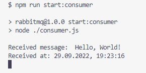

# Node.js + RabbitMQ Hello World

This app is just a demo of RabbitMQ possibilities. The app is implemented using Node.js

## Devendencies
This project requires [RabbitMQ Message Timestamp](https://github.com/rabbitmq/rabbitmq-message-timestamp) plugin installation.

## Set up

In the root of this project create a `.env` file with following contents:
```
RABBITMQ_CONN_URL=path_to_your_rabbitmq_instance
```

For example, `RABBITMQ_CONN_URL` can be either `amqp://localhost` or connection to a cloud instance.

## Running

Run both `npm run start:publisher` and `npm run start:consumer` commands to see the publish/consume process.

## Demo

